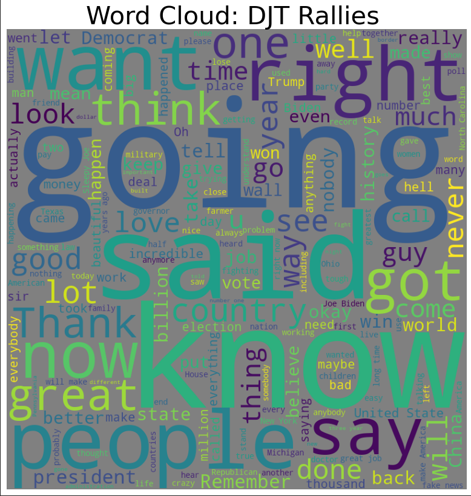
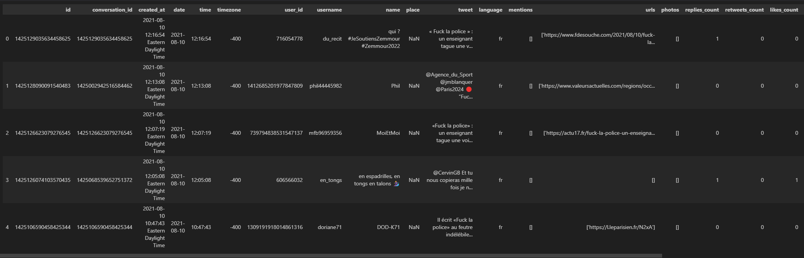

# Political Speech
The concept of **attention** in deep learning, particularly in the context of natural language processing (NLP), is a mechanism that allows models to focus on specific parts of the input sequence when making predictions or generating output. Attention mechanisms have significantly improved the performance of NLP models, particularly in tasks such as machine translation, text summarization, and language generation.

In traditional sequence-to-sequence models, such as those based on recurrent neural networks (RNNs) or encoder-decoder architectures, the entire input sequence is typically encoded into a fixed-size representation, which can lead to information loss, especially for long sequences. Attention mechanisms address this limitation by allowing the model to selectively focus on different parts of the input sequence, giving more weight to relevant information while ignoring irrelevant or less important parts.

The key components of an attention mechanism in NLP include:

Query, Key, and Value: In the context of attention, the input sequence is typically represented as a set of key-value pairs. The query represents the current state of the model, and the keys and values are derived from the input sequence.

**Attention Scores**: Attention scores are computed to measure the relevance of each element in the input sequence with respect to the current state (query). These scores are often calculated using a similarity function, such as dot product, scaled dot product, or a learned compatibility function.

**Attention Weights**: The attention scores are normalized using a softmax function to obtain attention weights, which represent the importance or relevance of each element in the input sequence.

**Context Vector**: The attention weights are used to compute a weighted sum of the values, resulting in a context vector that captures the most relevant information from the input sequence with respect to the current state.

**Integration with Model**: The context vector is then integrated into the model's computations, such as being used as an input to the decoder in sequence-to-sequence models, or being combined with the model's hidden states in recurrent neural networks.

The benefits of attention mechanisms in NLP include the ability to handle long sequences more effectively, capture dependencies between distant words, and improve translation and generation quality by focusing on relevant parts of the input.

Overall, attention mechanisms have become a fundamental component in many state-of-the-art NLP models, including transformer-based architectures, and have significantly contributed to the advancement of NLP tasks.

  
# Scraping Twitter
Using Twint, scraping the tweets without the Tweet API limitations of 3200 tweets. Doing the sentiment analysis on the fetched data  
The actual implementation served the political team to decide the location of the next meeting, and the overall sentiment after the political meetings happened  
  